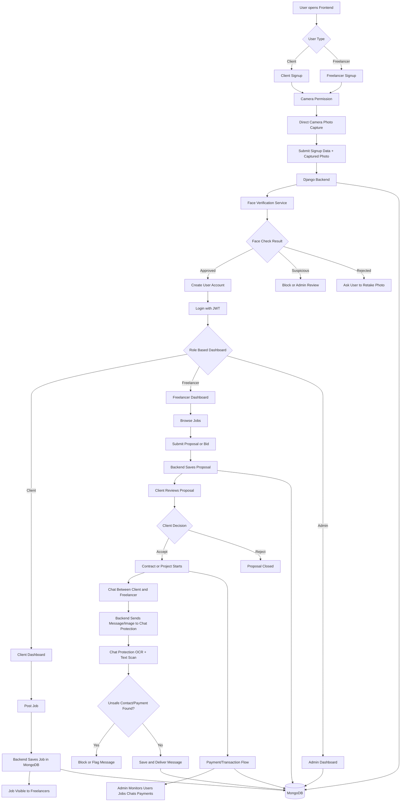

# Complete System Workflow

Ye document batata hai ki pura freelance marketplace system kaise kaam karega aur services ek dusre ke saath kaise integrated rahengi.

## Workflow Diagram



## 1. System Services

System ke main parts:

- **Frontend:** Next.js app. User yahin se signup, login, jobs, bids, chat, profile, admin dashboard use karega.
- **Backend:** Django REST API. Auth, users, profiles, jobs, proposals, bids, chat, payments, admin data handle karega.
- **MongoDB:** Main application data store.
- **Face Verification Service:** FastAPI + InsightFace. Signup ke time user ka face vector/embedding banata hai aur duplicate/suspicious account detect karta hai.
- **Chat Protection Service:** FastAPI OCR/text cleaner. Chat messages/images ko scan karke phone number, WhatsApp, Telegram, UPI, outside payment jaise risky content detect/normalize karta hai.

Docker compose ke through services:

- Frontend: `http://localhost:3001`
- Backend: `http://localhost:8000`
- Chat Protection: `http://localhost:8001`
- Face Verification: `http://localhost:8002`
- MongoDB: `localhost:27017`

## 2. User Signup Flow

Signup do tarah ka hoga:

- Client signup
- Freelancer signup

Common flow:

1. User frontend par register page open karega.
2. User basic details fill karega:
   - Name
   - Email
   - Password
   - Role
   - Phone/details agar required ho
3. Face verification ke liye frontend camera permission maangega.
4. User ko photo upload option nahi diya jayega.
5. User ki photo direct camera se capture hogi.
6. Captured photo frontend se backend ko bheji jayegi.
7. Backend face verification service ko call karega.
8. Face verification service image se face embedding/vector banayegi.
9. Service check karegi:
   - Same face already kisi account mein hai ya nahi
   - Similarity score suspicious threshold se upar hai ya nahi
   - Image valid face contain karti hai ya nahi
10. Agar face valid aur duplicate nahi hai, backend account create karega.
11. Agar duplicate/suspicious face mile, signup reject ya review ke liye mark hoga.

Important rule:

**Face verification photo sirf direct camera se leni hai. Upload/gallery option nahi dena hai.**

## 3. Login Flow

1. User email/password enter karega.
2. Frontend backend login API ko request bhejega.
3. Backend credentials verify karega.
4. Backend JWT access token aur refresh token return karega.
5. Frontend token local storage/context mein rakhega.
6. Role ke according user ko redirect kiya jayega:
   - Client dashboard
   - Freelancer dashboard
   - Admin dashboard

## 4. Profile Flow

Freelancer profile:

1. Freelancer skills, bio, hourly rate, portfolio, experience add karega.
2. Backend profile data MongoDB mein save karega.
3. Profile complete hone ke baad freelancer jobs browse/proposals submit kar sakta hai.

Client profile:

1. Client company/basic details add karega.
2. Backend data save karega.
3. Client jobs post kar sakta hai aur proposals review kar sakta hai.

## 5. Job Posting Flow

1. Client dashboard se post job page open karega.
2. Job title, description, budget, skills, deadline fill karega.
3. Frontend backend jobs API ko request bhejega.
4. Backend JWT token validate karega.
5. Backend confirm karega ki user client role ka hai.
6. Job MongoDB mein save hogi.
7. Job freelancer browse/search pages par visible hogi.

## 6. Freelancer Proposal/Bidding Flow

1. Freelancer jobs browse karega.
2. Freelancer kisi job par proposal submit karega.
3. Proposal mein cover letter, bid amount, timeline add hoga.
4. Backend freelancer auth/role validate karega.
5. Proposal MongoDB mein save hoga.
6. Client apne dashboard mein proposals dekhega.
7. Client proposal accept/reject kar sakta hai.
8. Accepted proposal se contract/project flow start hoga.

## 7. Chat Protection Flow

Chat ka goal hai ki client/freelancer platform ke bahar deal na karein.

Text message flow:

1. User chat message type karega.
2. Frontend message backend ko bhejega.
3. Backend message ko chat protection service par scan ke liye bhejega.
4. Protection service text normalize karegi.
5. Service risky terms detect karegi:
   - WhatsApp
   - Telegram
   - Phone numbers
   - UPI
   - GPay
   - Paytm
   - PhonePe
   - Direct payment
   - Pay outside
6. Agar risky content mile:
   - Message block/flag hoga
   - User ko warning milegi
   - Admin review ke liye record ja sakta hai
7. Agar message safe hai, backend message save karega aur chat mein show karega.

Image/OCR flow:

1. User chat mein image attach karta hai.
2. Backend image chat protection service ko bhejta hai.
3. Service OCR se image ka text extract karti hai.
4. Extracted text normalize hota hai.
5. Same risky content rules apply hote hain.
6. Unsafe image block/flag hoti hai.

## 8. Face Verification Integration Flow

Face verification service backend ke through use hogi.

1. Frontend camera se image capture karta hai.
2. Frontend backend signup/verification endpoint ko image bhejta hai.
3. Backend face verification service URL call karta hai.
4. Face service image validate karti hai:
   - Face present hai ya nahi
   - Multiple faces to nahi
   - Embedding generate ho sakti hai ya nahi
5. Face embedding vector store mein compare hoti hai.
6. Result backend ko milta hai:
   - `approved`
   - `suspicious`
   - `rejected`
7. Backend result ke basis par signup allow/block/review karta hai.

## 9. Skill Test Flow

1. Freelancer skills page open karega.
2. Available skill tests list hogi.
3. Freelancer test start karega.
4. Questions backend se load honge.
5. User answers submit karega.
6. Backend score calculate karega.
7. Passing score par skill verified mark hogi.
8. Verified skills profile aur job matching mein use hongi.

## 10. Payment Flow

Payment flow high-level:

1. Client accepted job/contract ke liye payment initiate karega.
2. Backend payment record create karega.
3. Payment status track hoga:
   - pending
   - paid
   - released
   - failed
4. Freelancer earnings dashboard mein amount show hoga.
5. Admin transactions dashboard mein payments monitor kar sakta hai.

Note: Real payment gateway integration ke liye production keys aur webhook verification required hoga.

## 11. Admin Flow

Admin dashboard ka kaam:

- Total users dekhna
- Clients/freelancers monitor karna
- Jobs monitor karna
- Suspicious chat/face verification cases review karna
- Transactions dekhna
- Platform stats check karna

Admin APIs protected honi chahiye. Sirf admin role wale user ko access milna chahiye.

## 12. Security Rules

System mein ye rules follow hone chahiye:

- Protected APIs JWT token ke bina accessible nahi honi chahiye.
- Signup mein face photo upload option nahi hona chahiye.
- Camera permission required honi chahiye.
- Duplicate face account creation block/review honi chahiye.
- Chat mein off-platform contact/payment sharing block honi chahiye.
- Admin endpoints role-based protected hone chahiye.
- Production mein secret keys `.env` se load honi chahiye.
- CORS sirf trusted frontend domains ke liye allow hona chahiye.

## 13. Expected End-To-End Flow

Complete client-to-freelancer flow:

1. Client signup karta hai camera face verification ke saath.
2. Client login karta hai.
3. Client profile complete karta hai.
4. Client job post karta hai.
5. Freelancer signup karta hai camera face verification ke saath.
6. Freelancer login karta hai.
7. Freelancer profile aur skills complete karta hai.
8. Freelancer job browse karta hai.
9. Freelancer proposal submit karta hai.
10. Client proposal accept karta hai.
11. Client aur freelancer chat use karte hain.
12. Chat protection unsafe content block karta hai.
13. Work complete hone par payment/contract flow update hota hai.
14. Admin dashboard se whole platform monitor hota hai.

## 14. Health Check Flow

System run hone ke baad ye checks pass hone chahiye:

- Frontend open ho: `http://localhost:3001`
- Backend health: `http://localhost:8000/api/health/`
- Chat protection health: `http://localhost:8001/health`
- Face verification health: `http://localhost:8002/health`
- MongoDB container healthy ho

Docker command:

```bash
docker compose up -d
docker compose ps
```

## 15. Camera-Only Signup Requirement

Signup UI mein:

- File upload input remove rahega.
- Gallery/photo upload allowed nahi hoga.
- User ko camera permission deni hogi.
- Capture button se photo li jayegi.
- Captured image preview show ho sakta hai.
- Retake option allowed hai.
- Submit tabhi allow hoga jab camera photo captured ho.

Recommended frontend behavior:

1. Page load par camera permission maango ya "Start camera" button dikhao.
2. Video preview show karo.
3. User "Capture photo" click kare.
4. Canvas se image blob/base64 banao.
5. Captured photo ko form data mein backend ko send karo.
6. "Retake" button se camera capture dobara allow karo.

## 16. Failure Handling

Camera fail:

- User ko clear message dikhao: camera permission required hai.
- Upload fallback mat do.

Face not detected:

- User ko retake karne bolo.

Duplicate face:

- Signup block ya admin review.

Chat unsafe:

- Message block karo.
- User ko platform policy warning dikhao.

Backend down:

- Frontend user ko retry/error state dikhaye.

Face service down:

- Signup temporarily unavailable ya review queue.

Chat protection down:

- Safer option: message send block karo ya pending review mein rakho.
